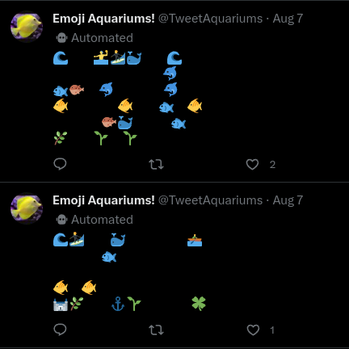

# Twitter Bot --> Emoji Aquariums :whale2:
_Simply a bot that tweets aquariums out of emojis._

 !! NOTE : DUE TO Twitters API restrictions and prices, I have closed the Twitter account since. !!
UPDATED 12/18/2023

This simple script simply authorizes a developer account onto Twitter via the Twitter API and gains the ability to post onto that account without ever needing to visit the webpage, simply using the API. 
Then, we have to prepare our tweet, following the specific tweet rules, ASCII spacing, controlled randomness variables, spacial constraints with each emoji on the tweet, etc. Then, we want to automate said
system by taking advantage of GitHubs environment variables which will keep our authorizing Twitter account tokens safe from developers viewing this code. Also, it'll allow me to use workflows, build an environment for the application and run it through GitHub servers, completely remotely from my device and running on a schedule set up by in the cron job files.   

Created using JavaScript, Twitter 2.0 API, GitHub environments and automated workflows.

Example:

 
 
 

Enjoy
